# ativ_sad
# Iniciando o ambiente
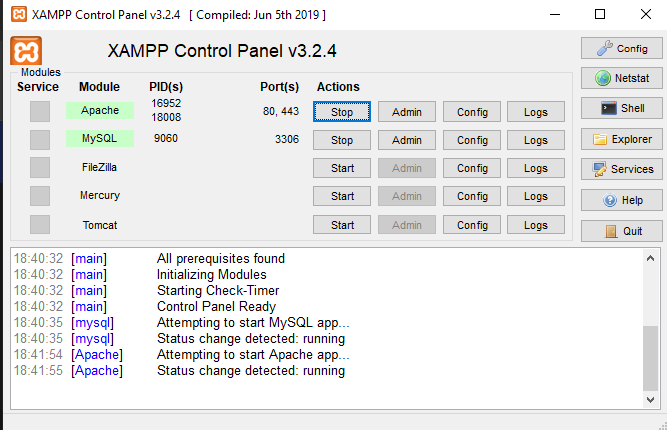

# Criando banco de dados
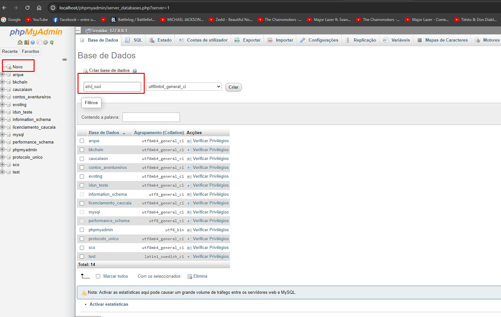

# Criando tabela Vendas
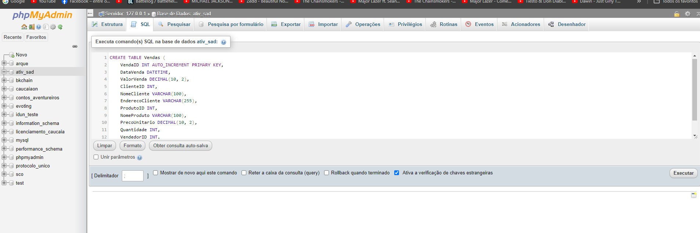
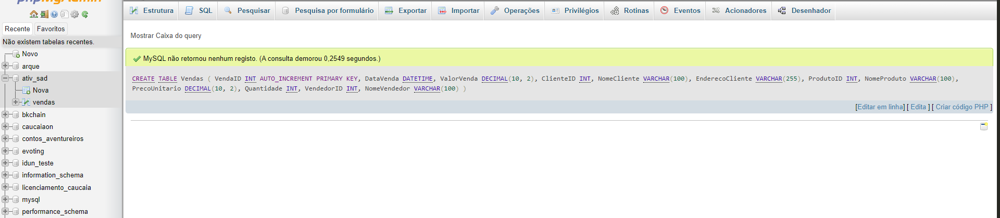

# Colocando dados na Tabela Vendas
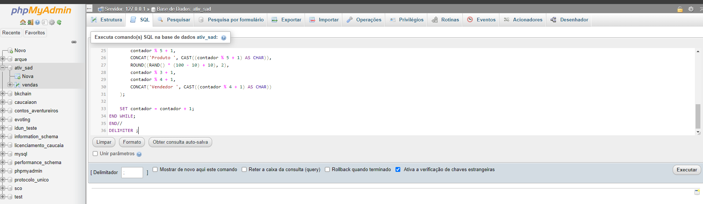
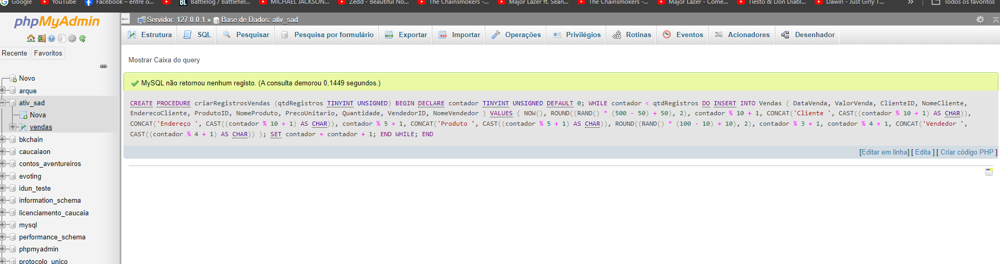
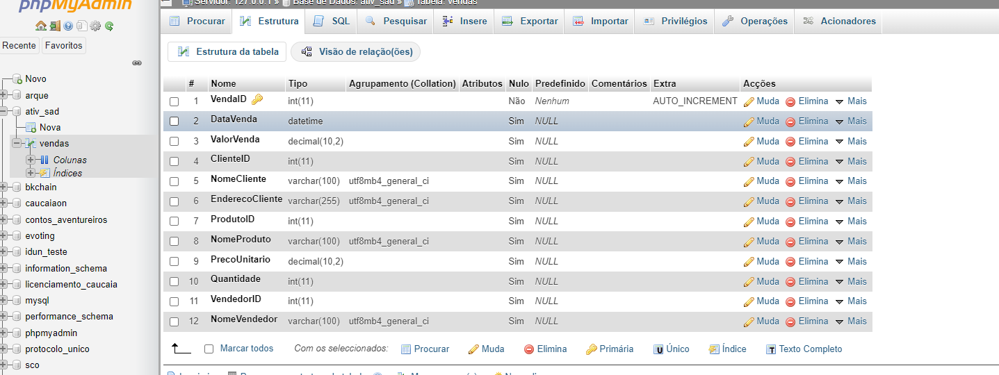

# três dimensões: Cliente, Vendedor e Produto
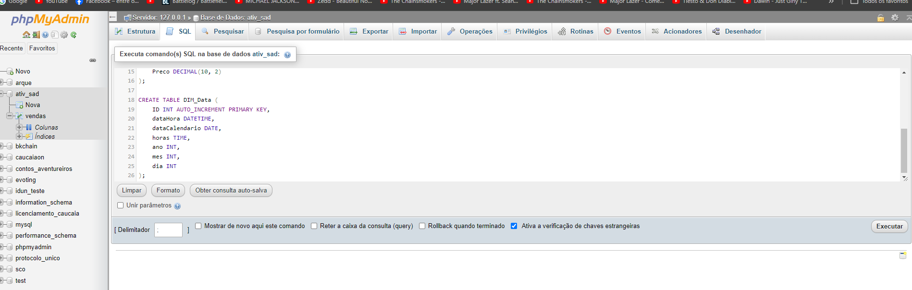
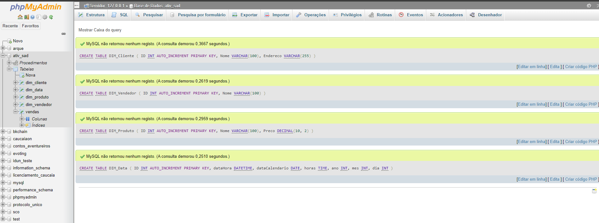
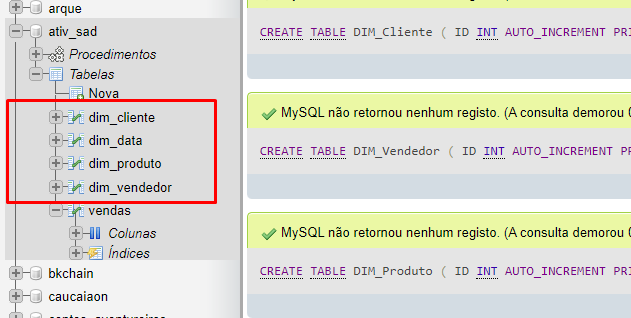

# Colocando dados nas Dimensões
# Cliente
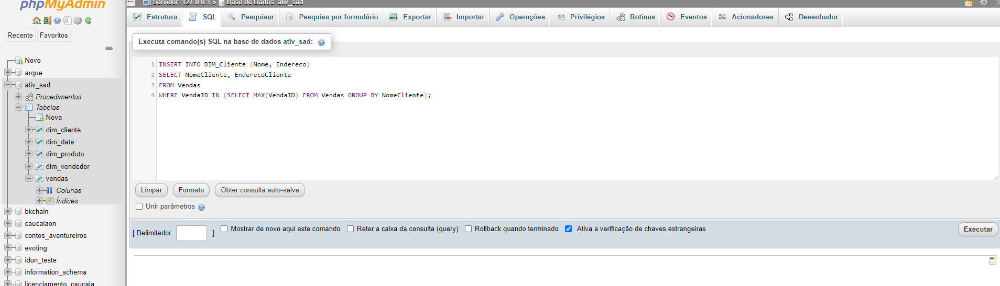
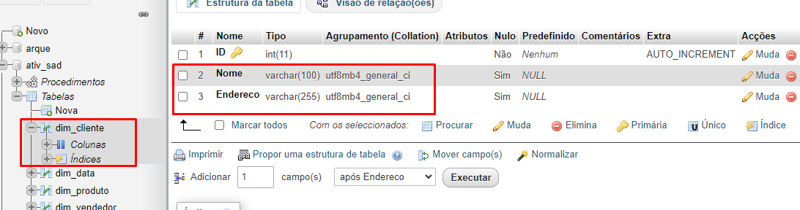

# Produto
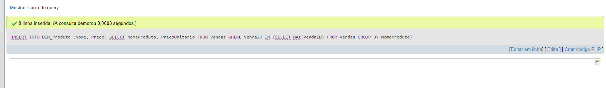
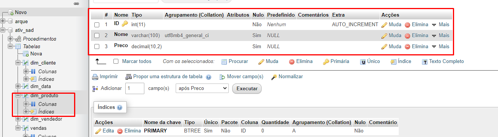

# Vendedor
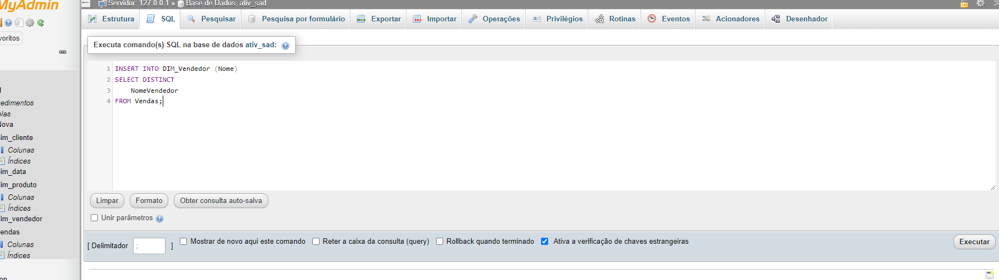
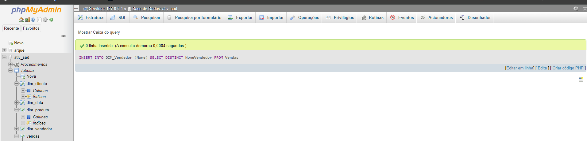

# Data
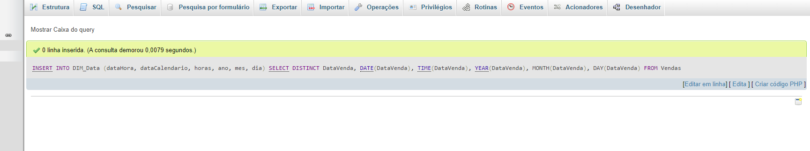
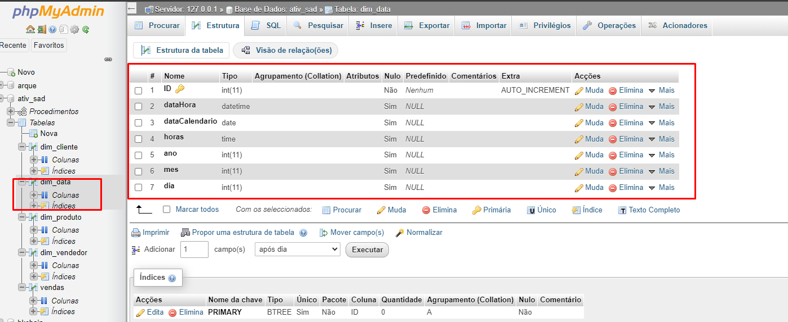

# Criando Tabela Fato
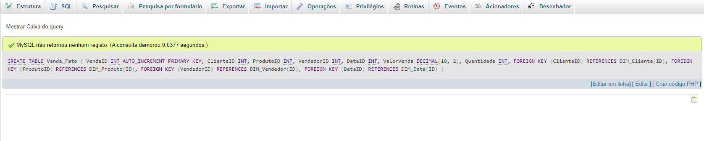
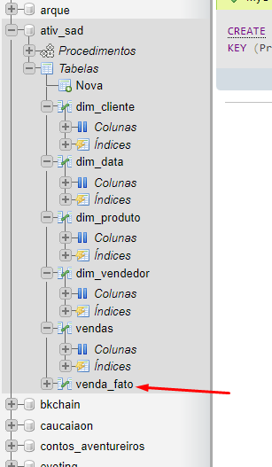
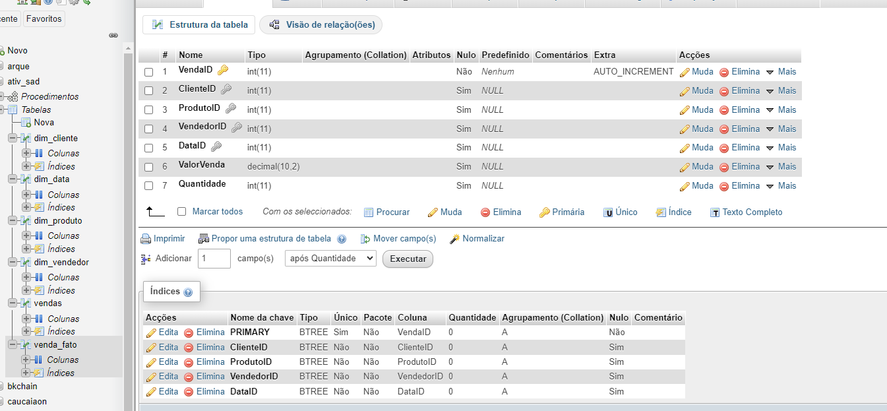

# Colocando dados na tabela Fato
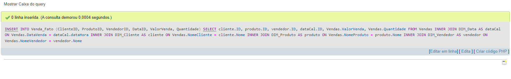

# Exibindo os dados da tabela fato com as dimensões
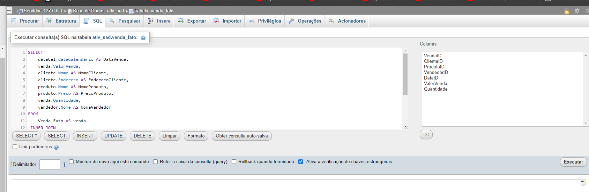
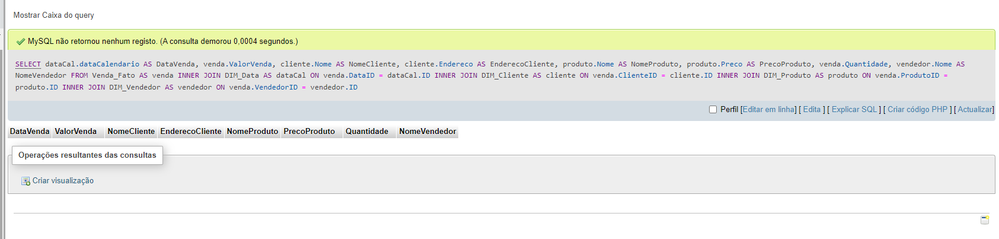