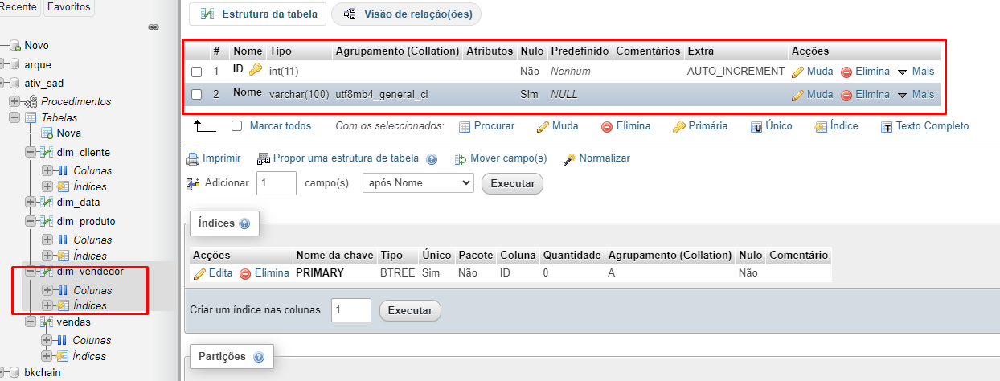

# ativ_sad
# Iniciando o ambiente

# Criando banco de dados

# Criando tabela Vendas

# Colocando dados na Tabela Vendas

# três dimensões: Cliente, Vendedor e Produto

# Colocando dados nas Dimensões
# Cliente

# Produto

# Vendedor

# Data

# Criando Tabela Fato

# Colocando dados na tabela Fato

# Exibindo os dados da tabela fato com as dimensões

